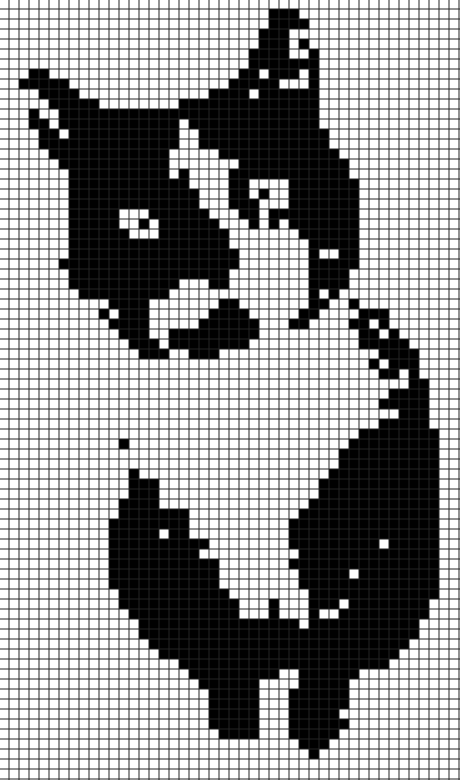

<p align="center">

</p>

# Image to Nonogram 🧮
Simple NodeJS script that takes a b&amp;w image and creates a Nonogram board.
## Installation Instructions

### Clone this repository

```bash
git clone https://github.com/michaelheckmann/img-to-nonogram.git
```

### Install dependencies

```bash
cd img-to-nonogram
npm install
```

### Run the script

```bash
node .
```
